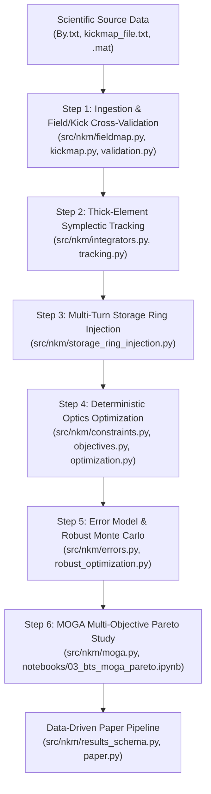

# NKM Simulation Procedure and Publication Workflow Guide

## 1. Overview & Physics Architecture

This document provides a single, unified, step-by-step specification for the complete simulation procedure and publication reproduction workflow of the Nonlinear Kicker Magnet (NKM) and Booster-to-Storage Ring (BTS) transfer line project.

### 1.1 Canonical Physical Units and Sign Conventions
- **Position**: Meters ($\text{m}$)
- **Angle / Canonical Momentum**: Radians ($\text{rad}$)
- **Energy**: Electron-volts ($\text{eV}$)
- **Magnetic Field**: Tesla ($\text{T}$)
- **Integrated Field**: Tesla-meters ($\text{T}\cdot\text{m}$)
- **Deflection / Kick Angle**: Radians ($\text{rad}$) or milliradians ($\text{mrad}$)

The horizontal kick angle for an ultra-relativistic electron beam is defined consistently by:

$$\Delta x' = \frac{q}{p_0} \int B_y\,ds$$

---

## 2. Comprehensive Simulation Procedure (Steps 1–6)



### Step 1: Field Map Ingestion & Cross-Validation
- **Modules**: `src/nkm/units.py`, `src/nkm/fieldmap.py`, `src/nkm/kickmap.py`, `src/nkm/validation.py`
- **Script**: `python3 scripts/validate_nkm_kick.py`
- **Procedure**:
  1. Ingest 1D field maps (`By.txt`) and 2D RADIA kick maps (`kickmap_file.txt`) with strict SHA-256 validation.
  2. Compute 5-way cross-validation comparing 1D field maps, 2D kick maps, spreadsheet data, analytical 4-wire model (`nlk.py`), and thin-kick tracking.
  3. Verify kick angle agreement to $< 10^{-12}\text{ mrad}$.

### Step 2: Thick-Element Symplectic Split-Operator Tracking
- **Modules**: `src/nkm/integrators.py`, `src/nkm/tracking.py`
- **Script**: `python3 scripts/run_tracking_convergence.py`
- **Procedure**:
  1. Slice the 0.31 m NKM into $N_{\text{slices}} = 40$ segments.
  2. Apply centered 2nd-order Drift-Kick-Drift split-operator integration ($\text{Drift}(dz/2) \to \text{Kick}(z_{\text{mid}}) \to \text{Drift}(dz/2)$).
  3. Verify slice convergence ($N_{\text{slices}} \ge 40$ converges exit angle to $< 5 \times 10^{-5}\text{ mrad}$).

### Step 3: Multi-Turn Storage Ring Injection & Capture
- **Module**: `src/nkm/storage_ring_injection.py`
- **Script**: `python3 scripts/run_multiturn_injection.py`
- **Procedure**:
  1. Load Accelerator Toolbox (pyAT) storage ring lattice (`storage_ring_lattice_nkm.mat`).
  2. Track 6D particles over $N_{\text{turns}}$ turns (Kicker active on turn 1, inactive on turns $2..N$).
  3. Evaluate 4 kicker models (`"off"`, `"ideal"`, `"linear"`, `"fieldmap"`) with physical aperture limits ($x \in [-30, 30]\text{ mm}, y \in [-15, 15]\text{ mm}$).

### Step 4: Deterministic BTS Optics Optimization
- **Modules**: `src/nkm/constraints.py`, `src/nkm/objectives.py`, `src/nkm/optimization.py`
- **Script**: `python3 scripts/optimize_bts_publication.py`
- **Procedure**:
  1. Stage 1: Bounded Least-Squares matching of 9 BTS quadrupoles.
  2. Stage 2: SLSQP refinement under physical hardware constraints ($K \in [-3.0, +3.0]\text{ m}^{-2}$, $B_{\text{pole}} \le 1.2\text{ T}$, peak beta $\le 60\text{ m}$).
  3. Compute SVD Jacobian sensitivity matrix $\mathbf{J} = \mathbf{U} \mathbf{S} \mathbf{V}^T$ to quantify quadrupole influence.

### Step 5: Error Budget & Monte Carlo Robustness Analysis
- **Modules**: `src/nkm/errors.py`, `src/nkm/robust_optimization.py`
- **Script**: `python3 scripts/run_publication_tolerances.py`
- **Procedure**:
  1. Model uncertainties across 5 categories: Optics, Orbit/Alignment, Beam, NKM, and Storage Ring errors.
  2. Apply rigidity-consistent energy error scaling ($B\rho = E/c$).
  3. Treat booster centroid jitter strictly as phase-space orbit shift independent of dispersion.
  4. Evaluate Monte Carlo percentiles (p50, p68, p95, p99), failure probabilities, bootstrap 95% CIs, and One-At-A-Time (OAT) sensitivity rankings.

### Step 6: MOGA Multi-Objective Pareto Trade-off Analysis
- **Modules**: `src/nkm/moga.py`, notebook `notebooks/03_bts_moga_pareto.ipynb`
- **Script**: `python3 scripts/run_publication_moga.py`
- **Procedure**:
  1. Formulate 3-objective NSGA-II optimization ($f_1 = M_x + M_y$, $f_2 = \max(\beta_x, \beta_y)$, $f_3 = \sqrt{D_x^2 + D_{px}^2}$).
  2. Enforce strict constraint feasibility ($CV \le 10^{-5}$). If no feasible solution exists, export the least-infeasible candidates with `success = False`.
  3. Compute physical beam envelope-to-aperture clearance $M_{\text{ap}} = r_{\text{pipe}} - (3\sqrt{\epsilon \beta} + |D_x \delta|)$.
  4. Evaluate multi-seed hypervolume convergence across 5 independent seeds.

---

## 3. Publication Workflow & Reproduction Pipeline (Steps 7–8)

### Step 7: Fully Data-Driven Paper Reproduction Pipeline
- **Modules**: `src/nkm/results_schema.py`, `src/nkm/paper.py`
- **Script**: `python3 scripts/reproduce_paper.py` (supports `-w, --workers W` and `--manifest` flags)
- **Procedure**:
  1. Verify cryptographic SHA-256 hashes of scientific input data files (`By.txt`, `kickmap_file.txt`, `K4GSR_HBIv4-1.mat`, `storage_ring_lattice_nkm.mat`).
  2. Initialize provenance schema layout (`results/paper/paper_run_<timestamp>/`).
  3. Calculate statistically consistent total RMS envelope:
     $$\sigma_x(s) = \sqrt{\epsilon_x \beta_x(s) + [D_x(s) \sigma_\delta]^2}$$
  4. Dynamically generate 300 DPI publication figures and LaTeX/Markdown tables directly from simulation models without hard-coded numbers.

### Step 8: Release Archival & Regression Verification
- **Artifacts**: `LICENSE` (MIT), `CITATION.cff`, `requirements-lock.txt`, `.github/workflows/ci.yml`, `.github/workflows/paper-regression.yml`
- **Script**: `pytest -v tests/test_paper_regression.py`
- **Procedure**:
  1. Run automated CI and regression test suite verifying integrated kick angle ($-5.7491 \pm 0.01\text{ mrad}$), optics mismatch, multi-turn centroid oscillation ($< 0.1\text{ mm}$), and quadrupole hardware bounds.
  2. Verify pre-release checklist (`docs/release_checklist.md`) and tag Zenodo-compatible release (`v0.1.0-rc1`).

---

## 4. Single-Command Execution Summary

| Task Phase | CLI Command | Description |
| :--- | :--- | :--- |
| **Field Validation** | `python3 scripts/validate_nkm_kick.py` | Runs 5-way field/kick cross-validation. |
| **Tracking Convergence** | `python3 scripts/run_tracking_convergence.py` | Runs $N_{\text{slices}}$ slice convergence study. |
| **Multi-Turn Injection** | `python3 scripts/run_multiturn_injection.py` | Evaluates turn-by-turn capture efficiency & kicker models. |
| **Deterministic Opt** | `python3 scripts/optimize_bts_publication.py` | Executes 2-stage SLSQP matching & Jacobian SVD analysis. |
| **Tolerance Budget** | `python3 scripts/run_publication_tolerances.py` | Runs Monte Carlo robustness & OAT sensitivity rankings. |
| **MOGA Trade-offs** | `python3 scripts/run_publication_moga.py` | Runs multi-seed NSGA-II Pareto optimization. |
| **Paper Reproduction** | `python3 scripts/reproduce_paper.py` | Regenerates all manuscript figures, tables & provenanced metrics. |
| **Test Suite** | `pytest -v` | Executes all 161 unit, integration, and regression tests. |

---

## 5. Protected Source Data Safeguards

Under project rules ([`AGENTS.md`](file:///home/cspark/Work/projects/nkm-injection/AGENTS.md)), the following scientific source data files are **immutable** and protected against accidental editing, stripping, or reformatting:
- `NKM_radia.ipynb`, `NKM_radia_y=0.ipynb`
- `nlk.py`, `storage_ring.ipynb`
- `*.xls`, `*.xlsx`, `*.xlsm`
- `*.npy`, `*.npz`
- `*.txt`

Before and after every execution, verify clean git status:

```bash
git status --short
git diff --name-only
```

---

## 6. Notebook Visualization Supplement

Notebooks 01-03 include rich inline publication-quality visualization cells:
- `notebooks/01_bts_main_simulation.ipynb` (VS-1 through VS-5): NKM longitudinal field profile, 2D kick map colormaps, mid-plane kick vs. position, BTS optics functions (β, D, μ), dynamic aperture footprint
- `notebooks/02_multiturn_injection_validation.ipynb` (§3.1–3.4): Capture efficiency bar charts, phase-space portraits (x–x', y–y') per kicker model, turn-by-turn survival history, real-space x–y footprint with aperture
- `notebooks/03_bts_moga_pareto.ipynb` (§4.1–4.4): Pareto front scatter matrix (3 objective pairs), hypervolume convergence history, quadrupole strength profile bar chart, objective radar chart

